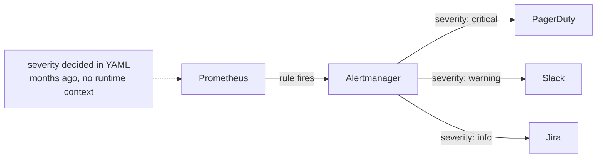
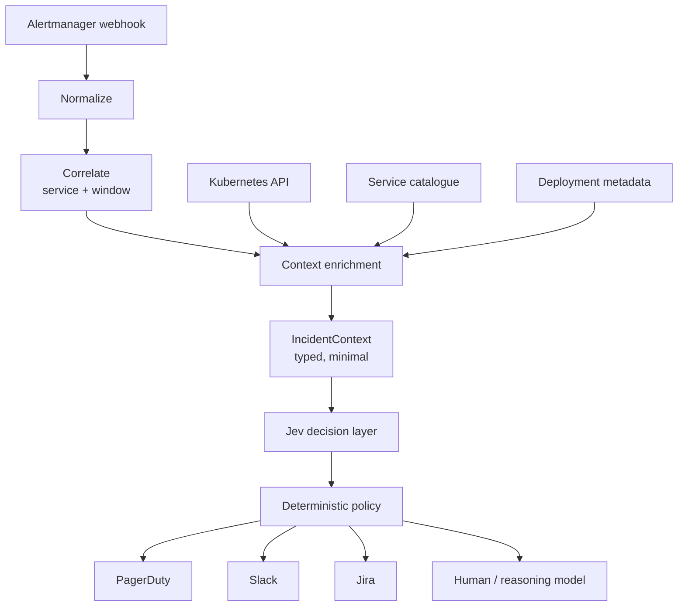
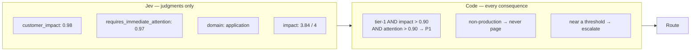
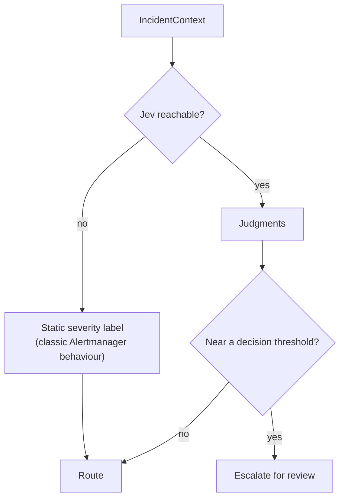

# Architecture

## Today

The routing is fine. The label feeding it is the problem.

## Proposed

## The separation that matters

Jev cannot page anyone. It returns numbers. `policy.py` turns numbers into
consequences, and it is the file to read in a post-incident review.

## Fallback

There is no branch where an alert is dropped.

## The six questions

One request, one parallel pass. Four Noul, one Choice, one Score.

| Key | Primitive | Asks |
|---|---|---|
| `customer_impact` | Noul | Are real users affected right now? |
| `material_degradation` | Noul | Is the service outside normal operation? |
| `requires_immediate_attention` | Noul | Must a human act now, or can it wait? |
| `deployment_related` | Noul | Does the timing line up with the last deploy? |
| `domain` | Choice | application / infrastructure / database / dependency / capacity / security / unknown |
| `impact` | Score | five ordered levels, negligible → total loss |

Why not simply ask "what priority is this?" Because priority is a policy
question, not a semantic one. It depends on your tiering, your on-call
contract and your error budget — none of which are visible in the telemetry.
Decomposing also makes failure legible: when a route is wrong you can see
*which* judgment was wrong, instead of arguing with a single opaque label.

## Two things the implementation taught us

**1. Noul returns no confidence.** `NoulAnswer` is `[type, noul]` — the
probability *is* the distribution. Choice and Score carry `confidence`; Noul
does not. Any "certainty" for a yes/no judgment is your construction.

**2. Distance from 0.5 is not uncertainty.** The obvious construction —
`abs(p - 0.5) * 2` — conflates "the model is unsure" with "the answer is
genuinely moderate". A half-degraded service *should* score ~0.6 on customer
impact; that is a confident answer. Gating on it sent every mid-severity
incident to human review, and scored a routine regression identically to a
genuinely borderline case (both 0.14).

What actually matters is proximity to the threshold the policy is about to
apply. `is_fragile(value, threshold)` escalates when moving the probability
slightly would flip the outcome. That is the operationally useful question.

## Correlation

Deliberately dumb: same namespace + service, within a window. Real correlation
wants a dependency graph, trace data and deploy topology. Jev does not solve
event correlation, and pretending otherwise would be the most over-claimed part
of this design.

## Failure modes

| Failure | Consequence | Mitigation |
|---|---|---|
| Jev unavailable | No judgments | Fall back to static severity; never drop |
| Stale service catalogue | Wrong owner, wrong tier | Treat unknown services as production/unknown-owner, never as unimportant |
| Missing Kubernetes data | Weaker context | Fields are optional; policy degrades rather than guessing |
| Model misclassification | Wrong route | Shadow mode; per-judgment logging; boundary escalation |
| Overconfidence near thresholds | Paging on noise | `is_fragile` escalates instead of acting |
| Question wording changes | Silent behaviour drift | Version the questions; re-run the labelled set |
| Context schema drift | Judgments on fields that moved | Typed models; the state sent is `IncidentContext.as_state()` only |
| Novel incident class | Out-of-distribution judgments | `unknown` domain exists and is a valid answer |
| **Untrusted alert text** | Attacker-influenced judgments | See below |

### Untrusted input

Alert labels and annotations can contain attacker-controlled strings — a URL
path, a user agent, a reflected error message. Anything that reaches `state`
is input to a decision that can suppress a page.

Recent work on decision models specifically ([JevOut, arXiv:2609.30243](https://arxiv.org/pdf/2609.30243))
reports that natural context shifts alone — no crafted attack — can flip model
predictions, with performance degrading toward chance under distribution shift.

Mitigations here: the state is a typed projection, not raw telemetry; no log
lines, request bodies, headers or customer data are forwarded; and suppression
is the *only* action the policy will take on low signals, never a destructive
one. Even so, treat "can an attacker influence this field?" as a design
question for every field you add.

## What is deliberately absent

No secrets, no tokens, no PII, no request bodies, no raw logs. `as_state()` is
the complete list of what leaves the process. Minimising it is a security
control first and a latency and cost win second.
